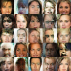
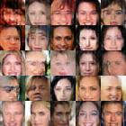

### Project View


In this project, I implemented a DCGAN for generating images of human faces, and the training images data sise >= 200K. The examples can be viewed in [link](https://github.com/tiandiao123/deep_learning/tree/master/face_generation/images_examples)

### To Test my algorithm:

step1: download data set
```
python download_data.py
```
step2: train model:
```
python face_generation_gan.py
```

### some final generated images to show:


