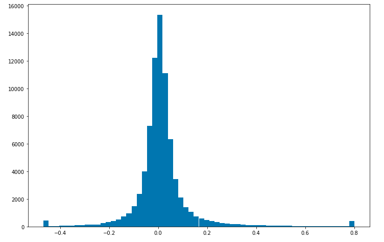
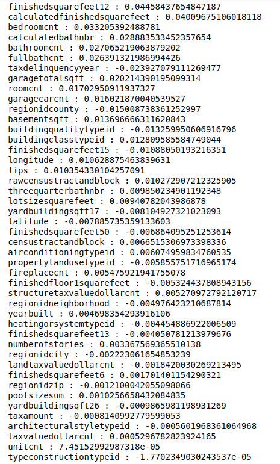
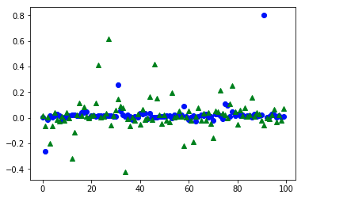
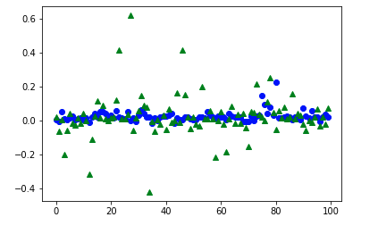
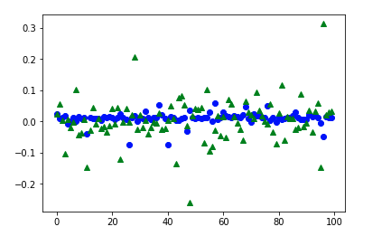

# Machine Learning Engineer Nanodegree
## Capstone Project
Jinchuan Wei 

Janunary 1st, 2019

## I. Review

### Project Overview
Zillow’s Zestimate home valuation has shaken up the U.S. real estate industry since first released 11 years ago. “Zestimates” are estimated home values based on 7.5 million statistical and machine learning models that analyze hundreds of data points on each property. And, by continually improving the median margin of error (from 14% at the onset to 5% today), Zillow has since become established as one of the largest, most trusted marketplaces for real estate information in the U.S. and a leading example of impactful machine learning.
In this project, based on data set which includes we are going to predict logerror of zillow price which is defined as the following:
```
logerror = log(zestimate) - log(SalePrice)
```
We have data set which has >= 50 columns of features and >= 90000 data samples, so we need to divide this data set into training data set and test data set so that we can train and test out model. Here are data set  we have(you can find them in my git repo):
```
properties_2016.csv - all the properties with their home features for 2016. Note: Some 2017 new properties don't have any data yet except for their parcelid's. Those data points should be populated when properties_2017.csv is available.
properties_2017.csv - all the properties with their home features for 2017 (released on 10/2/2017)
train_2016.csv - the training set with transactions from 1/1/2016 to 12/31/2016
train_2017.csv - the training set with transactions from 1/1/2017 to 9/15/2017 (released on 10/2/2017)
```
The reason why I think machine learning works is because out data set have many features, and we can create a regerssion model let the model predict best estimate which is close to actual values we have. 

### Problem Statement
In this problem, our input a large scale matrix (panda data frame) or numpy array which is transformed from our data set. As for every row of matrix, it represents a data sample, and every column represents a feature of data samples. The data type of data sample can be transformed into float when training our machine learning model. As for our output, we are going to predict the following logerror 
```
logerror = log(zestimate) - log(SalePrice)
```
In order to solve the problem above, we need to try several models, and choose the best model to set it as our final solution. Before working on testing our model, clearing data is also important in this case, since we have much noise in our data set including missing data and some miss-calculated data. Then, firstly, we can try some simple regression models such as linear regression and polynomial regression, and use mean square error to see whether it has reasonable performance. After that, we can improve our model by using some more complex models such as decision/random regression tree algorithms. After that, adding normalization to avoid over-fitting is also important in this case. In order to avoid over-fiting, in addition to use some normal methods such as L1/L2 norms, we can try ensemble methods such as bagging, cross-validation method, adaboost and gradient-boosting algorithms to try! Finally, we find both of adabooting decision regression and gradient boosting tree regression algorithms can have good perforamance compared to pure regression algorithms such as decision regression algorithm. 

### Metrics
In this project, we set mean square error as our metrics, which is defined as the following:
   $$Mean_squre_error$$ = \sum_{1}^{n}{model(input_data) - logerror}/n $$

In order to justify a good performance of our model in this case, we are going to try to find a mean square error <= 0.02 indicates a good model of this problem. 

## LaTeX

The editor converts LaTeX equations in double-dollars `$$`: $$ax^2+bx+c=0$$. All equations are rendered as block equations. If you need inline ones, you can add the prefix `\inline`: $$\inline p={1\over q}$$. But it is a good practice to place big equations on separate lines:

$$x_{1,2} = {-b\pm\sqrt{b^2 - 4ac} \over 2a}.$$

In this case the LaTeX syntax will be highlighted in the source code. You can even add equation numbers (unfortunately there is no automatic numbering and refs support):

$$|\vec{A}|=\sqrt{A_x^2 + A_y^2 + A_z^2}.$$(1)

It is possible to write Cyrillic symbols in `\text` command: $$Q_\text{плавления}>0$$.

One can use matrices:

## II. Analysis

### Data Exploration
In this project, the data set is huge, and we need to handle it very carefully. Firstly, since the data sample has over 50 features, some of them are lacking huge amount of data. In this case we have two options, either we ignore those features who have huge amount of missing data, or we can just fill those missing data with mean value of the other unmissed data. In this project, we tried the second option, which means that we fill missing data with mean values of those unmissed data. Then, what we need to is that we explore the distribution of logerror we need to predict, and it turned out that it looks like a guassian function. After that, we want to study the correlations between every feature and logerror. That's because higher correlations indicate that feature is more related to or more influential to logerror predictions. If the correlation of some feature and logerror is near zero, it means that that feature has nealy no effects on out logerror predictions. Using this way, we can just igore those feactures having lower correlations, and use features having higher correlations to train out model, which can save a huge amount of time and increase model's performance in some cases  

### Exploratory Visualization
Here is the logerror distribution figure:



Here is correlations between features and logerror:



### Algorithms and Techniques
#### method 1: decision tree regression
In this method, we first try a simple algorithm for predicting our logerror values. decision tree algorithm basically to choose most optimized feature to decide which category we need to choose so that we can get the most desired predition. Finally. we set the max-depth as 20 since we have over 50 features, but we cut off those unrelated features based on correlations and leave only 18 features in our columns features. Finally, we got a mean square error which is 0.021273486707590866, which is not very satisficatory. But, it is a good start! Here is what looks like when I sample some test data and compare it with my model's predictions



#### method 2: decsion tree plus adaboost algorithms:
In this case, we need to add ensemble method so that we can improve those models with bad performance and combine with models with good performace. For one thing, it can improve our final model's performance. For another thing, it can avoid overfitiitng. The final mean-saure error is 0.016951678638327763, which is good! 


#### method 3: gradient boosting tree regression algorithm 
In this case, we can use gradient boosting tree regression algrithm to improve our pure tree regression algorithm. The basical idea behind this algorithm is that we need to improve current model based on current difference bwteen current model's predictions and true logerror values. The issue for this algorithms, it can be over-fitting in some sense, but if we can carefully control the number of steps, it can significally improve the pure tree regression algorithms, the best model of this algorithm we tested has mean square error 0.01599242456077152.




## III. Methodology

### Data Preprocessing
As for data processing, as we talked above, firstly, we need to find all of features who have missing data since we couldn't train our model if we have missing data in our data set. There are two options, the first option will be that we can just ignore those features having missing data, but it can remove some valuable information of our data set. The second option is that we can fill those missing data based on mean values of the other unmissing data, which is more reasonale in this case. Thus, we choose the second option to handle data processing in out project. After that, we need to investigate how those features are related to logerrors we need to predict. In this case, we normally use correlations to determine whether that feature is correlated to our logerror. If the correlation between logerror and feature is near zero, it means that that feature is not correlated to out logerror we need to predict. If that correlation of some feature is close to 1, it means that feature has high correlations with logerror! Thus, based on the correlations we compute, we can get the desired features we need to select to train our model, which can save our training time! 

### Refinement
In this project, we firstly tried several simple regression algorithms such as linear regression, polynomial regression, support vector regression and decision tree regression, and we find that most of them don't satisfy our requirements. For one thing, they have very high test mean square error, and the predicted results don't match with logerror we need to predict! There are several reasons why they don't work very well. As for linear regression, the algorithm model complexity is very small, and we won't be able to use it to resolve some complex data set in this case. As for polynomial regression, in some sense, it can solve some disadvantages of linear regression, but it has huge disadvantage which is that it can be over-fitting. Thus, even we can have low training mean square error, but it is hard to control the model's degree to avoid overfitting. Thus, the flexibility of polynomial is that great! As for support vector regression, it has some limitaions. In this project, it doesn't have very obvious hyper-plane to divide data set, so it doesn't have good result in this case. Probably, we can try kernerl SVR, but we didn't try it. As for decision tree regression, since it can be used to work out in this project, and it does have good performance, but we couldn'ty make it satisfy our requirement no matter how to set parameters such as max-depth, learning rate. Then, we consider about add adaboost and gradient boosting to improve pure regression algorithm. Since tree regression algorithm has best performance among all of regression algorithms we tried, so we decide to add adaboost and gradient boosting algorithm on tree regression algorithm. It turned out that we improved tree regression algorithm's performance after adding ensemble method. As for adaboost algorithm, it balances between different models so that we can get the best model! In addition to adaboost algorithm, we also tried gradient algrithm, the basical idea behind this is that we continue to update our bad model into a better model, and we continue to improve our model until it satisfies some threshold we set! Using this ensemble method, not only it can improve our model's performance, but it also can avoid over-fitting, which can decrease test mean squre error to below 0.02, and it turned out that ensemble methods such as graident boosting and adaboost can help us realize the target! 


## IV. Results

### Model Evaluation and Validation
As for all of algorithms, we tested them on our test data after training. As for tree regression algorithm, we have test mean square error 0.021273486707590866. As for adaboost+decision tree algorithm, we have mean square error 0.016951678638327763. As for gradient boosting algorithm, we have mean squre error 0.01599242456077152. 


## V. Conclusion

### Reflection
In this project, the most difficult part for me is that we don't have any clue which algorithm to choose. Thus, we need to try multiple optential algorithms to test, abd see which algorithm should have best performance. Also, since it is a pure regression problem, so we cannot use some accuracy benchmark to determine whether this algorithm has good performance. The only thing we can do is that we try to minize cost function error(mean squre error we chose in this project), and draw figure to see whether our model has better performance. Also adjusting parameters of the algorithms is also challenging for us since some parameters huge impacts on out model's performance such as learning rate in tree regression algorithm. 

### Improvement
After that, we can probably do the following steps to improve our problem. 
option 1: try modern algorithm such as Xgboost whcih is a modern boosting algorithm, and we can use it to improve our model's performance
Option 2: we can try neural network to work on this regression problem. Just view features of data sample as input nodes of our fully-connected neural network, and the throw all of data into the nueral network to try our model. 
Option 3: Add more training data is also a good choice, since our data we use has many missing data, so we cannot guaranteen the realiability of data we use. Thus, before training, we can do some data augumentation or adding more data should be beneficial our training of models!
Option 4: Add more ensemble algorithms to our model should also be working! For example, combining bagging and adaboost should also improve the performance since we randomly select training data can increase our model's flexibility, and so it can help us get a more genralized model. If so, it can used to predict unseen data with more accuracy! 
