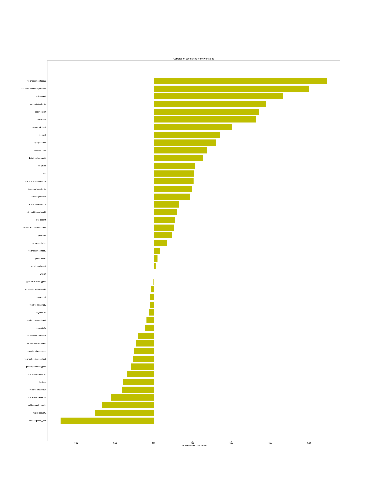
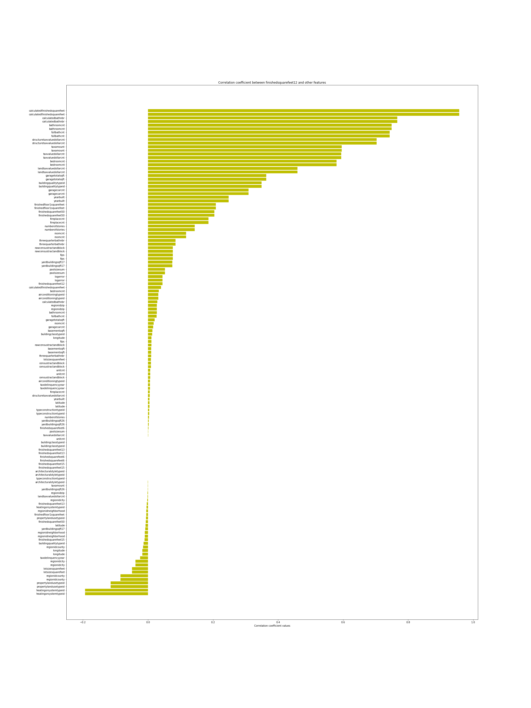
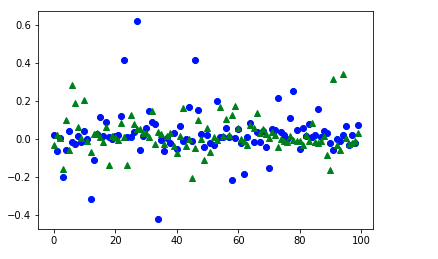
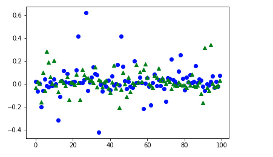
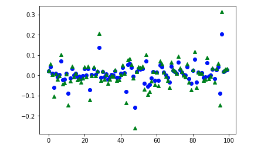
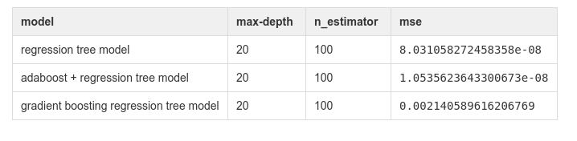

# Machine Learning Engineer Nanodegree
## Capstone Project
Jinchuan Wei 

Janunary 1st, 2019

## I. Review

### Project Overview
In my project, we are goint to zestimate and salesprice of house market of the united states. “Zestimates” are estimated home values based on 7.5 million statistical and machine learning models that analyze hundreds of data points on each property. And the sales price is the actual selling price of the house in the current market.
In this project, based on data set which includes we are going to predict logerror of zillow price which is defined as the following:
```
logerror = log(zestimate) - log(SalePrice)
```
We have data set which has >= 50 columns of features and >= 90000 data samples, so we need to divide this data set into training data set and test data set so that we can train and test out model. The training data is used to train our machine learning model, and the test data is used to test our machine learning to see whether this machine learning can be used to predict logerror of zillow price from those unseen test data set. If so, we can confirm our model reliability and robostness. Here are data set  we have(you can find them in my git repo):
```
properties_2016.csv - all the properties with their home features for 2016. Note: Some 2017 new properties don't have any data yet except for their parcelid's. Those data points should be populated when properties_2017.csv is available.
properties_2017.csv - all the properties with their home features for 2017 (released on 10/2/2017)
train_2016.csv - the training set with transactions from 1/1/2016 to 12/31/2016
train_2017.csv - the training set with transactions from 1/1/2017 to 9/15/2017 (released on 10/2/2017)
```
The reason why I think machine learning works is that machine learning algorithm such as linear regression and tree regression algorithm can be used to model this prediction and a regression problem. Based on regression model in machine learning, we are going to train a model to fit thes training data, and then test it in test data to see its performance.  

### Problem Statement
In this problem, our input a large scale matrix (panda data frame) or numpy array which is transformed from our data set. As for every row of matrix, it represents a data sample, and every column represents a feature of data samples. The data type of data sample can be transformed into float when training our machine learning model. As for our output, we are going to predict the following logerror 
```
logerror = log(zestimate) - log(SalePrice)
```
In order to solve the problem above, we need to try several models, and choose the best model to set it as our final solution. Before working on testing our model, clearing data is also important in this case, since we have much noise in our data set including missing data and some miss-calculated data. Then, firstly, we can try some simple regression models such as linear regression and polynomial regression, and use mean square error to see whether it has reasonable performance. After that, we can improve our model by using some more complex models such as decision/random regression tree algorithms. After that, adding normalization to avoid over-fitting is also important in this case. In order to avoid over-fiting, in addition to use some normal methods such as L1/L2 norms, we can try ensemble methods such as bagging, cross-validation method, adaboost and gradient-boosting algorithms to try! Finally, we find both of adabooting decision regression and gradient boosting tree regression algorithms can have good perforamance compared to pure regression algorithms such as decision regression algorithm. 

### Metrics
In this project, we set mean square error as our metrics, which is defined as the following:
```
   Mean_squre_error = \sum_{1}^{n}{model(input_data) - logerror}/n
```
In order to justify a good performance of our model in this case, we are going to try to find a mean square error <= 0.02 indicates a good model of this problem. 


## II. Analysis

### Data Exploration
In this project, the data set is from a kaggle competition called zillow home value prediction, here is the [link](https://www.kaggle.com/c/zillow-prize-1/data). Also, after drawing the distribution of logerror of the data set, and we can find that data set's logerror looks like a guassian distribution if we normalize it. Also, if we divide these datas based on different month, and we can find that the data set is distributed mostly from March to September. As for training data of 2017, we have over 10000 data samples. Firstly, since the data sample has over 50 features, some of them are lacking huge amount of data. In this case we have two options, either we ignore those features who have huge amount of missing data, or we can just fill those missing data with mean value of the other unmissed data. In this project, we tried the second option, which means that we fill missing data with mean values of those unmissed data. Then, what we need to is that we explore the distribution of logerror we need to predict, and it turned out that it looks like a guassian function. After that, we want to study the correlations between every feature and logerror. That's because higher correlations indicate that feature is more related to or more influential to logerror predictions. If the correlation of some feature and logerror is near zero, it means that that feature has nealy no effects on out logerror predictions. Using this way, we can just igore those feactures having lower correlations, and use features having higher correlations to train out model, which can save a huge amount of time and increase model's performance in some cases. For example, finished square feet has high correlations, and it means we need to keep it in our training data. On the other hand, typeconstructiontypeid feature has low correlation, and it means that we can just ignore this feature when we need to train our model!

Also, I diggged a little about the logerror we need to predict, and the max value of logerror is 0.5342337969890008, and the min value of logerror is -0.3198744301782, mean value is 0.01442724161915893, and std of it is 0.10523657921294056. Here is the code how I computed them:
```
print(max(train_df.logerror.values))
print(min(train_df.logerror.values))
mean_val = 0
for ele in train_df.logerror.values:
    mean_val += ele
print(mean_val/len(train_df.logerror.values))
print(np.std(train_df.logerror.values))
```

### Exploratory Visualization
Here is the logerror distribution figure:


what we can learn from this picture is that we can know the general distribution of logerror we need to predict. We can see that it looks like a gausssian distribution if we normalize it. Also, most of logerror values are distribued between -0.2~0.2.

Here is logerror distribution based on months:


what we can learn from it is that the logerror is distributed equally based on different months. Thus, at least we don't have to worry about unbalanced data with respect different month.  


Here is correlations between features and logerror:


Here is more visualized picture I drew based on the values I calculated



From the picture above, we can have general ideas what kind of features are the most important ones, and what kinds of features we can just ignore them when training our model! Thus, we can know that the first several features such as finishedsquarefeet12, bedroomcnt are very important for our training model since it is highly correlated to our actual logerror we need to predict. However, some features such as unitcnt and typeconstructiontypeid are not very important to our training models since it has low correlations with our logerror, so we can ignore them whem training to save some training time!

Also, we can compute correlations between different features(If two features have very low correlations, then it means these two features have similar properties, and we can just remove one of them to focus one of them. If so, we can save some training time)

For example, we can study correlations between finishedsquarefeet12 and other features. Here is the result:



After calculations, we find the following features have high correlations with 
```
calculatedfinishedsquarefeet : 0.9570383804488979
calculatedbathnbr : 0.7667116758058886
bathroomcnt : 0.7495820544775355
```
If some feature has high correlations with finishedsquarefeet12, then we can remove those features having high correlations with finishedsquarefeet12. In this case, we certainly can remove column features such as calculatedfinishedsquarefeet if we want to use column feature finishedsquarefeet12 in this case. 

### Algorithms and Techniques
#### method 1: decision tree regression
In this method, we first try a simple algorithm called tree regression for predicting our logerror values. The decision tree algorithm starts with a root node, and involves partitioning the data into subsets that contain data samples with similar values. Here are more explanation how this algorithm works in my project. For example. when we start from root node, we will go through all of column features, and calculate mean values of those features respectively. Then, for every specific data sample, we will compare feature's value with that mean value. Then, data sample will be decided to go to left sub-tree or right subtree based on whether its feature's value is larger than or less than mean value. As for picking which faeture to split the tree, we will choose the feature getting minimal mean squre error after splitting(By the way, the left tree node's predictin value will be mean value of logerrors for all of data samples going to left subtree. It is the same case for right sub-tree). Then, suppose we get to the left-tree, as for left-tree node, we continue go through all of features except those column featues have been used by parent nodes' spliiting to compute mean values, and choose best feature who will have minimal mean square error after splitting. Repeat that process until the model reaches maximum depth. Thus, at every tree node, we need to set a threshold for deciding which suntree for current data to go. For picking threshold value, we normalize using such as mean values, or we can use cross-valiation method to find the best threshold values in our model. Finally, decision tree algorithm will choose the most optimized feature to decide which category we need to choose so that we can get the most desired predition. At the end, we set the max-depth as 20 since we have over 50 features, but we cut off those unrelated features based on correlations and leave only 18 features in our columns features. Finally, we got a mean square error which is 0.021273486707590866, which is not very satisficatory. But, it is a good start! Here is what looks like when I sample some test data and compare it with my model's predictions


#### method 2: decsion tree plus adaboost algorithms:
In this case, we need to add ensemble method so that we can improve those models with bad performance and combine with models with good performace. We have introduced the decsion tree above. Now we are going to introduce adaboost algorithm. As for adaboost, instead of just picking one model to predict our results, we choose multiple different models, and combine them together to predict our results. More specifically, we are going to find several different models f1, f2, f3``````fn such that we can create a general model f = a1*f1 + a2*f2 + ``` + an*fn, and use this general model f to predict our logerror. In this case, firstly we use a normal regression tree to fit our data set, and deneote this first model as f1. Then, calculate its expected mean square error with respect to training data, and denote it as e1 = E(f1(training_data) - logerror of training data). In the following steps, different adaboost algorithm will handle it differently, but the main idea is that if we have large error e1, and it means that this model has bad performance, so we need to multiply a lower weight w1 to this model f1. On the other hand, if we have small error e1, and it means that we have a good model, then we need to highlight this model, and give it a larger weight w1. Also, after training every model, we also need to update our data points. If some data points cannot be fitted very well by some model fi, then we can add a larger weight w to this data points feature values to make next model become more sensitive to those highlighted data samples. If so, we can generate a stronger model. After that, we just need to combine all of models we just generated to make predictions. Using this way, we can gramatically improve the performance of our model. For one thing, it can improve our final model's performance. For another thing, it can avoid overfitiitng since it average different models to lower its variance. But we cannot totally avoid over-fitting problem in this case. We still need to become careful about parameter adjusting to avoid over-fitting in this case. The final mean-saure error is 0.016951678638327763, which is good! 

#### method 3: gradient boosting tree regression algorithm 
In this case, we can use gradient boosting tree regression algrithm to improve our pure tree regression algorithm. The basical idea behind this algorithm is that we need to improve current model into a new stronger model based on current difference bwteen current model's predictions and true logerror values. More specifically, if we have trained model f1, then we are going to train a new model f2' bto predict the difference logerror - f1(input_data). Then, we combine these two models to get a stronger model f2 = f1 + f2'. If we continue this process, finally we will get a very strong model! The issue for this algorithms, it can be over-fitting in some sense, but if we can carefully control the number of steps, it can significally improve the pure tree regression algorithms, the best model of this algorithm we tested has mean square error 0.01599242456077152.


Note: Both adaboost and gradient boosting are converting weaker model into stronger ones. Adaptive boosting changes the sample disbribution by modifying the weights attached to each of data sample. It increases the weights of the weaker model, and increase the weights of stronger models. On the other hand, graident boosting doesn't change weights of training data, and it trains on a newly sample distribution(the weaker model trains on the remaining errors). If so, we can get a stronger model after repeating previous steps for multiple times. 

## III. Methodology

### Data Preprocessing
As for data processing, as we talked above, firstly, we need to find all of features who have missing data since we couldn't train our model if we have missing data in our data set. There are two options, the first option will be that we can just ignore those features having missing data, but it can remove some valuable information of our data set. The second option is that we can fill those missing data based on mean values of the other unmissing data, which is more reasonale in this case. Thus, we choose the second option to handle data processing in out project. After that, we need to investigate how those features are related to logerrors we need to predict. In this case, we normally use correlations to determine whether that feature is correlated to our logerror. If the correlation between logerror and feature is near zero, it means that that feature is not correlated to out logerror we need to predict. If that correlation of some feature is close to 1, it means that feature has high correlations with logerror! Thus, based on the correlations we compute, we can get the desired features we need to select to train our model, which can save our training time! 


### Implementation
I used sklearn libaray to train our training data, and compare it with my implementation. I find that sklearn tree regression decision tree algorithm has better result if I choose max-depth as 20, and it shrinks my mean square error from 0.05 into 0.022 approxiamately. Here is core codes for training our model for simple tree regression algorithm:
```
from sklearn.tree import DecisionTreeRegressor
from sklearn.ensemble import AdaBoostRegressor
regr_1 = DecisionTreeRegressor(max_depth=20)
regr_1.fit(X_train, y_train)

```
After adjusting different parameters, we find that when max_depth == 20 gives us lowest mean squre error which is 0.021.
Then, we begin to improve the algrithm result, since we find the training data's mean square error is very slow (about < 0.01) compared to mean squre error of test data's mean squre error, so we assume that it could be overfitting. Thus, we want to add ensemble method to avoid overfitting such as adaboost. After adding adaboost, we find that we can dramatically improve the result, and we shrink the data set's mse from 0.021 to 0.016, and it has better result than the result of pure tree regression algorithm. Here is my core codes for adding adaboost:
```
regr_2 = AdaBoostRegressor(DecisionTreeRegressor(max_depth=20),
                          n_estimators=30, random_state=1)
regr_2.fit(X_train, y_train)                          

```  
Also, we need to adjsut the max-depth, and the number of n_estimators, we find that we can get the best result if we set the value of n_estimators as 100, and the number of max-depth as 25. If we increase max_depth, it will be no obious improvement or have some over-fitting problem in our case. Originally, I tried several different parameters such as max-depth and n_estimators. Originally, I was thinkging we could get the best performance when n_estimatores == 30 and the max-depth==25, but it turned out that I was wrong (I didn't continue to increase the number of n_estimator). However, after I changed n_estimator from 20 to 100, I found I can significantly improve the performance of the model. If I continue to increase the n_estimator, I found the mse has no obious changes. The best performance of adaboost regression tree algrithms can help us get 0.0021 mse.  
Here is core code for gradient boosting algorithm:
```
model = GradientBoostingRegressor(n_estimators = 10, learning_rate=0.01, max_depth=20, random_state=0, loss='ls')
model.fit(X_train, y_train)
```

In addition to it, I also tried cross-validation to adjust roboustness of my model, I found that our gradient boosting regression tree model has strong robust since we can get average mse 0.002 which satifies our requirement very well. Here are how I implemented:
```
### cross-validation to test our model
from sklearn.model_selection import cross_val_score
from sklearn.model_selection import KFold
model = GradientBoostingRegressor(n_estimators = 100, learning_rate=0.01, max_depth=25, random_state=0, loss='ls')
mean = 0
K = 10
for i in range(10):
    indexes = np.array(len(train_df)*[0])
    if i!=9:        
        X_train, X_test = train_df[int(((i+1)/10)*len(train_df)):len(train_df)], train_df[int((i/10)*len(train_df)):int(((i+1)/10)*len(train_df))]
        y_train, y_test = train_y[int(((i+1)/10)*len(train_df)):len(train_df)], train_y[int((i/10)*len(train_df)):int(((i+1)/10)*len(train_df))]
    else:
        X_train, X_test = train_df[0:int(0.9*len(train_df))], train_df[int(0.9*len(train_df)): len(train_df)]
        y_train, y_test = train_y[0:int(0.9*len(train_df))], train_y[int(0.9*len(train_df)): len(train_df)]
    
    
        
        
    model.fit(X_train, y_train)
    cur_mean = mean_squared_error(y_test, model.predict(X_test))
    print("current mean == {}".format(cur_mean))
    mean += cur_mean
print("we split traing data into {} parts, and the average mean is {}".format(length, mean/K))

```

### Refinement
In this project, At the most of time I tried many algorithms including tree regression model, adaboost tree regression model, gradient boosting regession model, and then we have cross-validation to test my models' rosbustness. As for tree regession model, at the most of time, we need to focus on which column features to train, and what value of max-depth we need to set for this model. At the begining, we just include all of featuers into my traning data, and focus on how to adjust max-depth so that we can have bettwe performance. Thus, initially, I set max-depth as 5, and then it turned out that this value 5 is bad choice since our mean squared error is 0.5 which is not that good. Also, after drawing some predicted pictures, we find that most of test data's predicted logerror are far away from actual logerror. Thus, I graudally increase the number of max-depth into 10, 15, 20 and 25. Then, we find that when max-depth == 20 and 25, we can get very good result, and we have mse 8e-8. And we have picture below:



Then, we are going to use adaboost algroithm to refine our previous model regression tree algorithm. Firstly, we need to study how to set n_estimator and max-depth. Under the fixed n_estimator, we tried max-depth 5, 10, 15, 20, 25, 30 and 35, and it turned out that the mean sqaure error has no obious changes when max-depth>=20. Thus, we fix max-depth==20, and adjust n_estimator. Originally, I set n_estimator as 30, and it will help us get mse 0.016. Howerver, if I changed n_estimator from 30 into 60, 80, 100, 120. We find that we can get a strong model when n_estimator==100, and the mse can be 1.05e-8. Here are some randomly selected data samples predicted by this model:



Then, we tried gradient boosting regerssion tree algorithm to see how it works compared to other methods we tried. First of all, we only use featues with high correlations with logerror to train, and it turned out that we can get mse error 0.016 even we set the number of n_estimator as 100, but the result is not as good as adaboost algorithm. Then, we add more featues (up to 30 features), things get better since we can decrease mse error. Now, when we use 45 most important features (having high correlations with logerror), we can decrease mse into around 0.002. Even though the mse error is not as good as adaboost, but it still satisfied our expectation. Here is several pictures to show some predicted result:



## IV. Results

### Model Evaluation and Validation
As for all of algorithms, we tested them on our test data after training. As for tree regression algorithm, we have test mean square error 0.021273486707590866. As for adaboost+decision tree algorithm, we have mean square error 0.016951678638327763. As for gradient boosting algorithm, we have mean squre error 0.01599242456077152. 
As for the model the roboustness, for example, we do add some outliers in our training model, and it turned out that adaboost regressiobn tree regression algorithm has strong tolerance for those noise data. Overall, it can still help us achieve good performance compared to pure simple tree regression algorithm. Also, I used cross-validation method to test our gradient boosting regression model, we get the average mean square error 0.0019 which satisties our requirement, and it also can prove our model is robust in this case. Here are cross-validarion result:
```
current mean == 0.002140589616206769
current mean == 0.002029173966014433
current mean == 0.002008536622792608
current mean == 0.0019443885479634208
current mean == 0.0017347878367147082
current mean == 0.001950712651191539
current mean == 0.0018337416870197987
current mean == 0.0016234681985008049
current mean == 0.001869138581318882
current mean == 0.0020920371714845125
we split traing data into 10 parts, and the average mean is 0.0019226574879207474

```


### Justification
Overall, we achive the benchmark we set in the begining, and it means that our model can make test data's mean squre error smaller than 0.02. After drawing some predicted pictures for our test data, we can confirm our benchmark is reasonale, and our model is very strong and robust. Here are a table to show (the last column is the mse of test data):

 


## V. Conclusion

### free-from visualization
Here are predicted results' of some of data sample ramdomly selected from test data set. The first figure is tree regression algorithm's performance, and the second picture is the result of adaboost tree regression algorithm, and the third picture is gradient boosting tree regression algorithm's performance.  
The following pictures' x axis just the data samples' indexes, and y-axis is the logerror. Also, the blue dot represents predcited logerror by model, and the green triangle represents actual logerror.
The first picture is the predicted result of regression tree model 


The second picture shows result of adaboost regession tree model


The third picture shows the result of gradient boosting regression tree model


Here is a more detailed table to show test data mse (test data and training data are the same for all of models)
 

### Reflection
In this project, the most difficult part for me is that we don't have any clue which algorithm to choose. Thus, we need to try multiple optential algorithms to test, abd see which algorithm should have best performance. Also, trying to refine algorithms is also a chanlenging part for me since some slightly change such as the change of n_estimator and the change of max-depth can have significantly impacts on the final result. Thus, we need to gradually change parameters to see how some parameters will impact on the final result! 

### Improvement
After that, we can probably do the following steps to improve our problem. 
option 1: try modern algorithm such as Xgboost whcih is a modern boosting algorithm, and we can use it to improve our model's performance
Option 2: we can try neural network to work on this regression problem. Just view features of data sample as input nodes of our fully-connected neural network, and then throw all of data into the nueral network to try our model. 
Option 3: Add more training data is also a good choice, since our data we use has many missing data, so we cannot guaranteen the realiability of data we use. Thus, before training, we can do some data augumentation or adding more data, which should be beneficial our training of models!
Option 4: Add more ensemble algorithms to our model should also be working! For example, combining bagging and adaboost should also improve the performance since we randomly select training data can increase our model's flexibility, and so it can help us get a more generalized model. If so, it can be used to predict unseen data with more accuracy!
